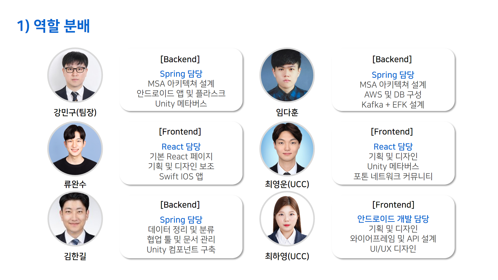

# 💎 C;SAFY - 개발자를 위한 CS, 기술 면접 교육 서비스


## C;SAFY 링크 : [https://csafy.com/](https://csafy.com/)

## 소개 영상 보기 : [UCC 링크](https://www.youtube.com/watch?v=vC_rSzX2tU4)

</br>

## 📘 프로젝트 진행 기간

2022.04.11(월) ~ 2022.05.20(금) (40일간 진행)  
SSAFY 6기 2학기 자율 프로젝트 - C;SAFY

</br>

## 🏅 C;SAFY - 배경

개발자로 취업하기 위해 꼭 공부해야 하는 것 중 하나는 바로 기술면접 대비를 위한 Computer Science 지식입니다.

개발자를 꿈꾸는 사람들은 CS를 공부하기 위해 하염없이 구글링을 하고 책을 사서 읽습니다.

지루한 공부방법은 이제 그만, **C;SAFY와 함께 이제는 스마트하게 공부하세요.**

</br>

## 🔎 C;SAFY - 개요

_- 최고의 효율로 CS공부를 하자 -_

**C;SAFY**는 Computer Science Academy For Youth의 약자입니다.

C;SAFY는 방대한 CS 정보를 분야별로 제공하고, 실전 면접의 기출문제를 제공하여 실력 향상에 도움을 줍니다.

기술면접과 인성면접에 자주 등장하는 질문이 주어지면 모의로 대답해보고 대답한 내용을 들은 뒤 피드백 할 수 있습니다.

CS관련 용어를 가볍게 학습할 수 있는 기능도 제공하며, 시간과 장소에 구애받지 않는 공부환경을 위해 모바일 앱서비스 또한 제공합니다.

문제를 풀고나면 어느 분야가 취약한지 분석하고, 최적의 공부효율을 위해 틀린 문제 위주로 복습할 수 있는 기능을 이용할 수 있습니다.

스터디그룹을 꾸려서 다같이 공부할 수 있도록 메타버스 가상 교실 환경에서 서로 정보를 공유할 수 있습니다.

즐겁고 재미있게 공부하는 공간인 OX퀴즈 서바이벌 공간을 메타버스에서 체험할 수 있습니다.

</br>

## 💎 주요 기능

---

-   ### 일반 학습

    -   분야별로 양질의 수업을 제공하는 인터넷 강의를 시청할 수 있습니다.
    -   크게 6가지로 분야가 나뉘어있습니다.
    -   자료구조 / 컴퓨터구조 / 운영체제 / 네트워크 / 데이터베이스 / 기타
    -   강의별로 즐겨찾기 설정을 할 수 있어서 다음에 다시 듣고싶은 강의를 저장할 수 있습니다.

        <br/>

-   ### 집중 학습

    -   분야별로 키워드학습 / 4지선다 / OX퀴즈를 통해 문제를 풀어볼 수 있습니다.
    -   키워드 학습에서는 CS 관련 용어를 간단하게 접하고 그 뜻을 암기할 수 있도록 카드 뒤집기 형태로 제공됩니다.
    -   4지선다와 OX퀴즈에서 학습한 CS지식을 평가해볼 수 있습니다.

         <br/>

-   ### 면접 대비

    -   면접관이 자주 질문하는 인성면접과 기술면접 질문을 확인하고 미리 준비할 수 있습니다.
    -   자신만의 대답을 녹음한 뒤 대답을 듣고 피드백 할 수 있습니다.
    -   시간 제한 모드로 설정하여 시간내에 대답하는 연습을 할 수 있습니다.

          <br/>

-   ### 메타버스

    -   같은 공간에서 여러 사람들과 같이 채팅할 수 있는 C;SAFY만의 가상공간입니다.
    -   단체학습실은 자신이 공유하고싶은 강의를 여러 사람들과 함께 시청할 수 있는 공간입니다.
    -   칠판을 이용하여 설명하고 싶은 내용을 입력하면 다른 이에게도 칠판에 내용이 공유됩니다.
    -   개인학습실은 혼자 강의를 듣거나 프리젠테이션 연습을 할 수 있는 공간입니다.
    -   면접실은 3명의 면접관이 앉아있는 공간에서 면접을 시작하면 질문이 들어옵니다. 자신의 대답을 녹음하고 돌려들으며 피드백 할 수 있습니다.
    -   퀴즈존은 CS문제를 OX퀴즈 형식으로 많이 맞추는 사람이 승리하는 오락 공간입니다.

          </br>

-   ### 실력 테스트

    -   시험을 치뤄서 자신이 얼마나 공부했는지 평가할 수 있는 기능입니다.
    -   실전 모의고사를 치루고 틀린 부분에 대해서 복습을 할 수 있는 오답노트를 이용할 수 있습니다.
    -   시험 결과를 통해 공부가 잘 된 분야는 무엇인지, 취약한 분야는 어느것인지 분석 데이터가 누적됩니다.

          </br>

-   ### 데이터 분석

    -   시험을 통해 모아진 데이터를 분석하여 과목별 학습 포인트를 확인할 수 있습니다.
    -   어느 과목이 취약점인지 한 눈에 알아볼 수 있도록 육각 그래프를 통해 시각적으로 확인할 수 있습니다.
    -   최근에 치룬 모의고사 점수가 그래프로 나타나서 현재 성적이 상승곡선인지 아닌지 한 눈에 파악할 수 있습니다.

          </br>

-   ### 게이미피케이션

    -   1일 1학습을 하여 잔디밭을 심는 학습일지 기능을 제공합니다.
    -   여러가지 조건을 달성하면 획득할 수 있는 뱃지가 있습니다
    -   얼마나 꾸준히 공부했는지 보여주기 위해, 성취욕을 해소하기 위해서 공부가 요구되기 때문에 학습 효율을 향상시킬 수 있습니다.

          </br>

## ✔ 주요 기술

---

**Backend**

-   Springboot 2.6.3
-   Spring Data JPA
-   Spring Security
-   Spring Validation
-   Spring Web
-   QueryDSL
-   WebSocket
-   Redis
-   MariaDB
-   fluentd
-   elasticsearch
-   kibana
-   metricbeats

**Backend - Flask**

-   SQLAlchemy

**Frontend**

-   React
-   Recoil
-   MUi
-   Unity
-   Photon
-   WebGL
-   Webstomp-Client 1.2.6
-   Sock.js-Client 1.5.2
-   sweetalert2 11.3.10
-   Swift
-   Android

**CI/CD**

-   AWS EC2
-   NGINX
-   SSL
-   Docker

---

## ✔ 프로젝트 파일 구조

---

### Frontend

```
csafy-frontend
  ├── node_modules
  ├── public
  └── src
      ├── components
      │   ├── atoms
      │   ├── common
      │   ├── companyClassification
      │   ├── Home
      │   └── myPage
      ├── pages
      │   ├── handler
      │   └── StudyPage
      ├── recoils
      └── utils

```

### Backend

```
backend-flask
backend
  ├── auth-service
  │   ├── api
  │   ├── clinet
  │   ├── config
  │   ├── dto
  │   ├── entity
  │   ├── exception
  │   ├── info
  │   ├── error
  │   ├── repository
  │   ├── service
  │   └── util
  ├── chat-service
  │   ├── api
  │   ├── clinet
  │   ├── config
  │   ├── dto
  │   ├── error
  │   ├── repository
  │   └── service
  ├── cs-service
  │   ├── api
  │   ├── clinet
  │   ├── controller
  │   ├── dto
  │   ├── entity
  │   ├── repository
  │   ├── scheduler
  │   └── service
  ├── pay-service
  │   ├── client
  │   ├── controller
  │   ├── dto
  │   └── service
  ├── user-service
  │   ├── api
  │   ├── clinet
  │   ├── config
  │   ├── dto
  │   ├── entity
  │   ├── exception
  │   ├── info
  │   ├── repository
  │   ├── service
  │   └── util
  ├── eureka
  └── gateway
      └── config
```

## ✔ 협업 툴

---

-   Gitlab
-   Notion
-   Gather Town
-   JIRA
-   Slack
-   Figma
-   Zeplin
-   MatterMost
-   Webex
-   Code With Me
-   Visual Studio Live Share

## ✔ 협업 환경

---

-   Gitlab
    -   코드 버전 관리
    -   이슈 발행, 해결을 위한 토론
    -   MR시, 팀원이 코드리뷰를 진행하고 피드백 게시
-   JIRA
    -   매주 목표량을 설정하여 Sprint 진행
    -   업무의 할당량을 정하여 Story Point를 설정하고, In-Progress -> Done 순으로 작업
    -   소멸 차트를 통해 프로젝트 진행도 확인
-   회의
    -   Gather Town 아침회의 진행, 전날 목표 달성량과 당일 할 업무 브리핑
    -   각자 위치에서 건네야 할 말이 생기면 팀원의 위치로 이동하여 전달
    -   빠른 소통과 신속한 대응 가능
-   Notion
    -   회의가 있을때마다 회의록을 기록하여 보관
    -   회의가 길어지지 않도록 다음날 제시할 안건을 미리 기록
    -   기술확보 시, 다른 팀원들도 추후 따라할 수 있도록 보기 쉽게 작업 순서대로 정리
    -   컨벤션 정리
    -   간트차트 관리
    -   스토리보드, 스퀀스다이어그램, 기능명세서 등 모두가 공유해야 하는 문서 관리
-   Slack
    -   현재 작업 상황 공유
    -   기능 수정 공지
    -   투표 진행
-   Figma
    -   목업 제작, 와이어프레임제작, 디자인 작업 공유
-   Zeplin
    -   프론트엔드 페이지 형태 상세 구성 및 공유
-   Visual Studio Live Share
    -   실시간으로 의사소통하며 받으며 함께 코딩
    -   피드백의 빠른 반영 가능
    -   집단지성을 이용해 코드의 신뢰성과 작업속도 향상

## ✔ 팀원 역할 분배

---



## ✔ 프로젝트 산출물

---

-   [기능명세서](docs/기능명세서.md)
-   [디자인&컨셉기획](docs/디자인&컨셉기획.md)
-   [비지니스모델](docs/비지니스모델.md)
-   [시스템구성도](docs/시스템구성도.md)
-   [와이어프레임](docs/와이어프레임.md)
-   [컨벤션](docs/컨벤션.md)
-   [ERD](docs/ERD.md)
-   [시스템기술서](docs/C;SAFY_시스템_기술서.docx)

## ✔ 프로젝트 결과물

-   [포팅메뉴얼](exec/CSAFY_포팅_메뉴얼.docx)
-   [중간발표자료](ppt/CSAFY중간발표.pptx)
-   [최종발표자료](ppt/CSAFY최종발표.pptx)

## 🎵 C;SAFY 서비스 화면

---

### 메인화면

-   C;SAFY에서 제공하는 서비스들을 스크롤을 내리면서 한 눈에 파악할 수 있도록 구성하였습니다.
-   애니메이션 효과를 주어 부드러운 효과를 주었습니다.


<br>

### 일반 학습

-   6가지 과목 중 선택하여 원하는 강의를 들을 수 있습니다.


<br>

### 키워드 학습

-   선택한 과목에 관련된 키워드가 등장합니다.
-   속으로 뜻을 생각해보고 마우스를 올려서 의미를 확인할 수 있습니다.


<br>

### 4지선다 문제

-   틀린 것을 고르는 문제가 나옵니다. 4가지 선택지 중, 틀린 내용을 고르면 됩니다.
-   시작하기 전 몇 문제를 풀 것인지 선택할 수 있습니다.


<br>

### OX퀴즈

-   문장을 읽고 옳은 내용인지, 틀린 내용인지 판단하여 선택하는 문제가 나옵니다.
-   시작 전 몇 문제를 풀 것인지 선택할 수 있습니다.


<br>

### 용어 백과사전

-   궁금한 CS 용어를 검색해서 찾아볼 수 있습니다.


<br>

### 면접대비

-   인성면접 또는 기술면접을 선택하고 자신만의 대답을 녹음하고 재생해볼 수 있습니다.
-   질문 목록만 확인할 수도 있습니다. 목록으로 들어가서 댓글을 달 수 있습니다.


<br>

### 모의고사

-   일반 모의고사 또는 실전 모의고사를 선택할 수 있습니다.
-   모의고사를 치루고 그 결과에 따라서 자신의 프로필에 학습 데이터가 쌓입니다.


<br>

### 메타버스 - 메인로비

-   캐릭터를 고르고 C;SAFY 메타버스에 입장하실 수 있습니다.


<br>

### 메타버스 - 단체학습실

-   단체학습실에서 방장이 재생하는 강의영상을 같은 공간의 모두가 같이 시청할 수 있습니다.
-   방장이 칠판에 공유하고 싶은 내용을 입력하면, 모두가 그 내용을 확인할 수 있습니다.


<br>

### 메타버스 - 면접실

-   실제 면접관 앞에서 면접을 보는 것처럼 질문을 받고 대답할 수 있습니다.


<br>

### 메타버스 - 퀴즈존

-   문제 갯수를 선택하고 게임이 시작되면 문제가 출력됩니다.
-   문제를 읽고, 맞는 설명이면 O로, 틀린 설명이면 X로 이동하면 됩니다.
-   정해진 문제 수가 전부 제시될때까지 계속하는 모드와, 최후의 승자를 가리는 서바이벌 모드가 존재합니다.
-   서바이벌 모드에서 우승할 시에 시상대로 이동됩니다.


<br>

### 메타버스 - 펫

-   메인 로비의 카운터에서 말을 걸면 펫을 선택해서 따라다니게 할 수 있습니다.
-   해금되지 않은 펫은 C;SAFY 서비스 내의 특정 조건을 만족시키면 이용할 수 있습니다.


<br>

### 챗봇

-   C;SAFY 내의 챗봇을 이용하여 궁금한 점에 대한 문의를 할 수 있습니다.
-   관리자가 접속중이라면 실시간으로 관리자에게서 문의에 대한 답변을 채팅으로 들을 수 있습니다.


<br>

### 학습분석데이터

-   지금까지 시청한 강의, 풀었던 문제, 그리고 치룬 시험의 결과 데이터를 한 눈에 파악할 수 있도록 그래프와 함께 제공됩니다.


<br>

### 프리미엄 회원제

-   프리미엄 버전을 구독하여 프리미엄 멤버가 되어보세요.
-   특수한 펫을 이용할 수 있으며, 프로필 이미지 테두리에 프리미엄 회원임을 알 수 있는 효과가 생깁니다.


<br>

### 모바일 환경

-   iOS와 안드로이드 운영체제에서 C;SAFY 서비스를 이용할 수 있습니다.
-   스마트폰이 있다면 장소에 구애받지 않고 CS공부를 할 수 있습니다.


<br>

### C;SAFY 학습데이터를 깃허브에 공유하자

-   플라스크 서브 서버를 이용한 깃허브 꾸미기 기능을 제공합니다.
-   SVG 이미지를 REST하게 변환하여줍니다.

```
-   https://csafy.com/api/v4/card/{가입이메일}
```


